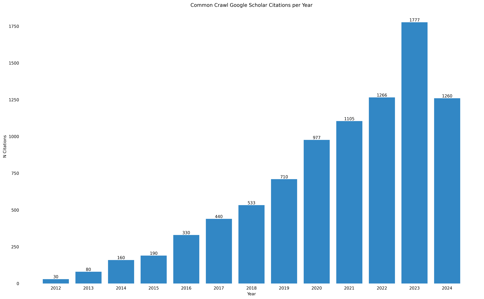

# Common Crawl Citations – BibTeX Database

BibTex files are in [bib/](./bib/)

Note: work in progress, still contains only a fraction of recent articles

## Fields Specific for Common Crawl

The following non-standard fields are used to add information how the publications relate to Common Crawl:

<dl>
<dt>cc-author-affiliation</dt>
<dd>affiliation of the authors</dd>
<dt>cc-class</dt>
<dd>classification of the publication: domain of research, topics, keywords</dd>
<dt>cc-snippet</dt>
<dd>snippet citing Common Crawl</dd>
<dt>cc-dataset-used</dt>
<dd>subset of Common Crawl used, e.g., CC-MAIN-2016-07</dd>
<dt>cc-derived-dataset-about</dt>
<dd>the publication describes a dataset which has been derived from Common Crawl, e.g., GloVe-word-embeddings</dd>
<dt>cc-derived-dataset-used</dt>
<dd>a dataset has been used which is derived from Common Crawl, e.g., GloVe-word-embeddings</dd>
<dt>cc-derived-dataset-cited</dt>
<dd>a derived dataset is cited but not used</dd>
</dl>

## Formatting and Export of Citations

The [Makefile](./Makefile) contains targets to apply a consistent formatting to the citations. It also allows to export the citations. The following BibTeX tools are required: [bibtex2html](https://www.lri.fr/~filliatr/bibtex2html/), [bibclean](https://ctan.org/tex-archive/biblio/bibtex/utils/bibclean), [bibtool](http://www.gerd-neugebauer.de/software/TeX/BibTool/en/).

(Do not be confused by the pypi package bibclean, it's entirely different. bibclean, bibtool, and bibtex2html are available as OS packages, at least in apt-based distros.)

## Citations from Google Scholar Alerts

As an initial step and to get a higher coverage, citations are extracted from Google Scholar Alert e-mails received April 2016 to date. See [gscholar_alerts](./gscholar_alerts/).

## Plotting the Data

A Python script for plotting citations over time is included in this repository.

_Fig 1: Plot of Common Crawl citations in Google Scholar as of July 29th 2024_
